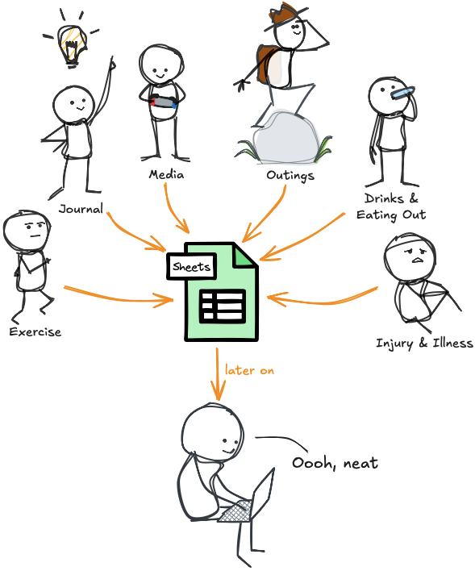

# Maximizing Life Satisfaction by Applying Machine Learning to a Data Journal

- Author: Aaron Gillespie  
- Date: 2025-04-20

> [!tldr]
> A somewhat tongue-in-cheek project utilizing machine learning and business intelligence tools against **12 years of quantified self data** to determine, once and for all, what contributes to a satisfying life. Compiled for fun, but also as part of Northwest Missouri's CSIS 44670 Final. 

This repository is being created in service of Northwest Missouri State University 44608 Module 6 - Exploratory Data Analysis. It will accomplish the following objectives from the module:

- demonstrate skills with Jupyter, pandas, Seaborn and popular tools for data analytics
- utilize machine learning to develop predictive models
- tell a data story and visually present findings in a clear and engaging manner

And, in my case, will include one additional objective:
- Utilizing my long-running quantified self project / data journal for an grad school assignment

## About the Dataset

The data gathered for this work are from many sources. The primary data sources are: 

- my long-running [Data Journal](https://aarongilly.com/Pages/Data-Journal) project
- my Oura ring
- Apple Health & various other apps

The data all represent me & my life over the past 12 years. For the purposes of machine learning, the dataset will only reach back ~8 years, as I didn't start doing my daily "Satisfaction" score until June, 2017.

### The Data Journal - in short:

Data Journal is a system I built to help me keep track of stuff that happens in my life. Its form has changed greatly over the past decade, but its function has remained the same: to house data about things I do. It’s a default place to make note of things that might not otherwise have a place. I’ve tracked lots of different things over the years.

Building and maintaining a Data Journal is an easy and incredible habit to get into. I think everyone could benefit from having one of their own, tracking the things that are important to them.

For more on my Data Journal, read [this page on my personal site](https://aarongilly.com/Pages/Data-Journal).

## Section 0. Pre-work

The full version of this dataset contains a multitude of things I wouldn't want published online, so much scrubbing & pre-work was done *before* the creation of the `data/` folder.

Pre-work included sourcing data from various apps, fed by various pieces of hardware over the past decade.

The full dataset would include things like daily summaries, details about where I've gone, who I've spent time with, etc. None of those data features are present in this public-facing dataset. Thus those factors will not be considered in this model.

While I was doing this sanitization - to facilitate the machine learning model I converted **categorical** data to **numeric** data using a form of **one-hot** encoding. For example, I converted an `exercise type` column into three separate columns for each exercise type I track.

This was done by hand, and it isn't *techincally* "one" hot. For example, I could run & lift weights on the same day, which would translate to `1` in both the `Strength` and `Cardio` columns.

## Sections 1 through 5

See `gillespie_ml_data_journal.ipynb` for this content.

## Section 6. Final Thoughts & Insights

### Future Work - Extensions

While my dataset is extensive, it's missing all sorts of things I'd *like* for it to have. 

- **Diet** - While I **do** have some calories and macronutriet data, I do not have many factors relevant to a healthy life, such as the level of processing that went into the food
- **Biomarkers** - in particular blood sugar from a continuous glucose monitor
- **Photos** - I'd like to run all my photos through a classification model & have data about the contents of said photos, who am I taking photos of, what settings, etc
- **Natural Language Processing** - this is full down-the-rabbit-hole territory, but it would be neat to see sentiments pulled from [my personal blog](https://aarongilly.com), the volume of [my public-facing notes](https://gillespedia.com), etc.