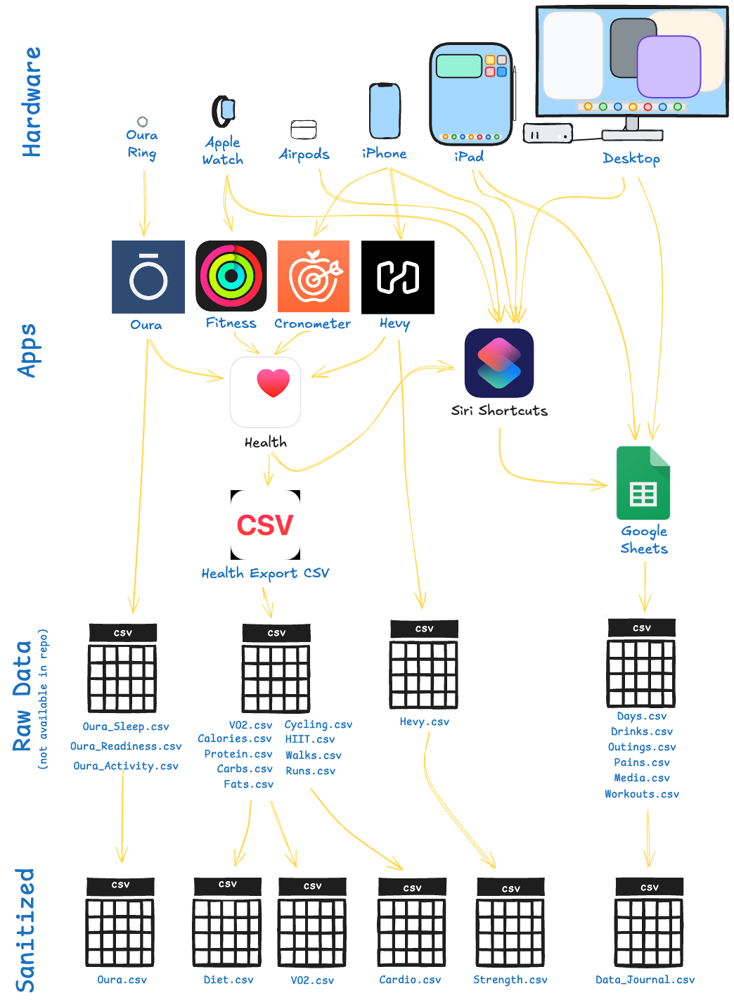
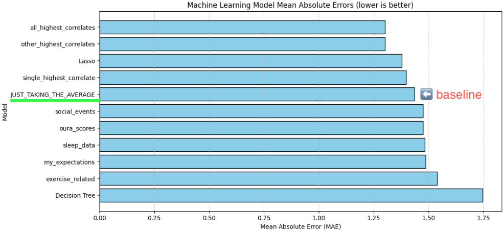

# Maximizing Life Satisfaction by Applying Machine Learning to a Data Journal

- Author: Aaron Gillespie  
- Date: 2025-04-20

> [!NOTE]
> A somewhat tongue-in-cheek project utilizing machine learning and business intelligence tools against **12 years of quantified self data** to determine, once and for all, what contributes to a satisfying life. Compiled for fun, but also as part of Northwest Missouri's CSIS 44670 Final. 

This repository is being created in service of Northwest Missouri State University 44608 Module 6 - Machine Learning Final Project. It will accomplish the following objectives from the module:

- demonstrate skills with Jupyter, pandas, Seaborn and popular tools for data analytics
- utilize machine learning to develop predictive models
- tell a data story and visually present findings in a clear and engaging manner

And, in my case, will include one additional objective:
- Utilizing my long-running quantified self project / data journal for an grad school assignment

This process was *extensive*, this README will serve as the tip of the iceburg.

> [!IMPORTANT]
> See `gillespie_ml_data_journal.ipynb` for this content.

## Overall Summary

I trained 10 machine learning models to predict my daily subjective `satisfaction` rating (which ranges from 1 to 10). Given 50+ relevant facts about my day, how closely could an ML algorithm come to predicting how satisfying I would rate that day?

The best model, a linear regression model utilizing the **fifteen** most highly-correlated features, was capable of predicting my `satisfaction` to within +/- 1.3 points, on average (MAE = 1.30). This means if the model guessed a `6.0`, we could say with 50% confidence that the real value lay somewhere between `4.7` and `7.3`, inclusive.

While that *sounds* good, this is **not** a highly predictive model. 

Simply predicting the average `satisfaction` value, regardless of all other data, would yield an MAE = 1.44. The 50% confidence interval is `4.56` and `7.44`. Thus, given NO information and simply predicting `satisfaction` = `6.0` every time we'd barely be worse off than using sophisticated machine learning techniques utilizing thousands of datapoints.

What does this say about life? What does this say about machine learning?

The data features most highly correlated with `satisfaction` were surprising.

1. `active_calories` - from my Oura Ring, [their documentation](https://cloud.ouraring.com/v2/docs#operation/Single_daily_activity_Document_v2_usercollection_daily_activity__document_id__get) says this is a measure of "Active calories expended", a daily total
2. `steps` - also Oura Ring, "Total number of steps taken", which would correlate highly with #1 
3. `satisfaction_running_avg` - looking at the previous 3 days to make your prediction about today
4. `work_status_endocded` - weekends are generally more satisfying
5. `health` - my subjective health rating, 1 to 10, made at the same time I do the `satisfaction` rating

All of those were positively correlated with increased `satisfaction`. Interestingly, **nothing** in the top 5 has to do with sleep, actual *workouts* (as opposed to generic activity), and/or social outings. 

The predictive power considering the strongest *negative* correlates were lower than the positive correlates. The most negatively correlated features were:

1. `temperature_deviation` - from my Oura Ring, "Temperature deviation in degrees Celsius." - I believe during sleep, indicating some fluntuation in health and metabolism.
2. `treatments` - indicating some form of medication or physical therapy took place
3. `pains` - indicating something hurt enough to warrant tracking, almost 1:1 with `treatments`
4. `lift_volume_lbs` - one of the most surprising contraindications here, when I lift MORE, I feel less satisfied
5. `awake_time` - from my Oura Ring, time spent *awake* while trying to sleep the night before

You can track dozens of datapoints about your life, but that doesn't make your subjective **life satisfaction** a highly-preditable phenomenon. Machine Learning is an **awesome technique**. It can be used to reliably predict the weather many days from now using phenomenon observed today... but it's not capable of devining results in a low-vailidity environment, such as the highly abstract nature of life satisfaction.

> [!NOTE] 
> If you want to be more satisfied it wouldn't hurt to move more and work and be sick less...  
> ...but there's not much you can do to "hone" `satisfaction` levels using what's tracked here.